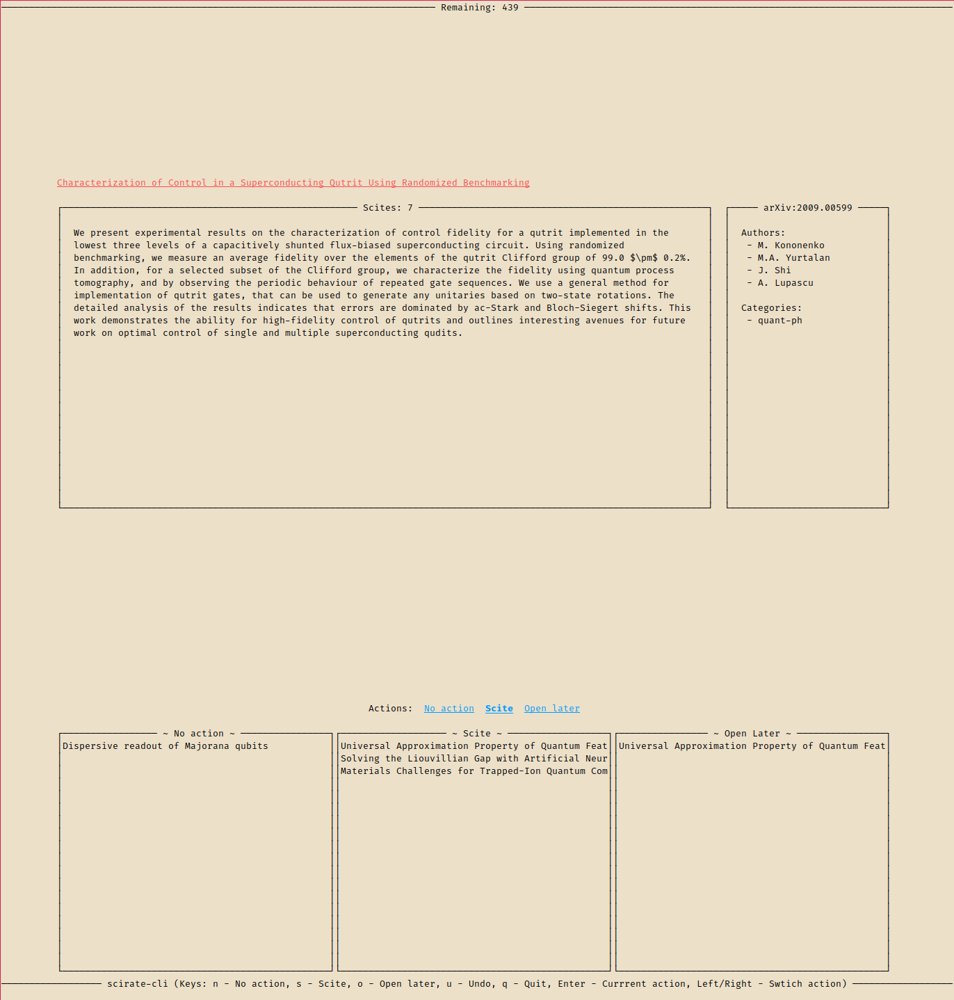

# scirate-cli

cli browsing tool for <https://scirate.com>. Trade scrolling for pressing buttons!





# Usage

1. Clone the repo:
  ```
  git clone https://github.com/silky/scirate-cli.git
  ```

1. Install this via stack: 
  ```
  stack install
  ```

1. Get your scirate cookie, when you are logged in, by looking in the
   the devtools of google chrome. You want the one that starts with:
   `_scirate3_session`.

1. Make a folder `~/.scirate-cli` and make a file `~/.scirate-cli/.env` and
   put the following:

   ```
   SCIRATE_COOKIE=<that cookie value>
   ```

1. Run `scirate-cli --new --range 1` to query todays papers!


Once you complete a session (i.e. all papers decided on) it will commit your
scites.

You have to open the `Open later` papers manually by running:

```
sh ~/.scirate-cli/openLater.sh
```

You can resume a session by just running `scirate-cli`.


#### Trivia

Alternative name for this project:

- scimate
